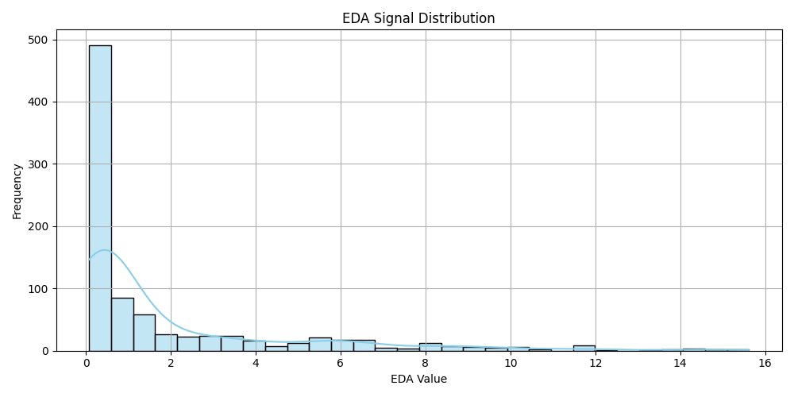

# EDA Signal Distribution Analysis
## Overview
This report summarizes the exploratory data analysis (EDA) of Electrodermal Activity (EDA) signals, including distribution visualization, boxplot analysis, and normality tests. The data shows strong deviations from normality, which is typical for physiological signals like EDA.

## Key Visualizations

### 1. Histogram with Kernel Density Estimate (KDE)

This histogram displays the distribution of the EDA (Electrodermal Activity) signal values that reveals:

Strong Positive Skew: The vast majority of the data points are clustered towards the lower end of the EDA value range, specifically around 0. This creates a long tail extending towards higher values. This suggests that high EDA values are relatively infrequent in this dataset.

Peak at Low Values: There's a very prominent peak in the frequency around EDA values close to zero, indicating that these low values are the most common.

Decreasing Frequency: As the EDA value increases, the frequency of occurrence generally decreases. This is characteristic of a positively skewed distribution.

- Few Outliers: While there's a tail extending to higher values, the frequency drops off significantly, suggesting that extreme high EDA values (potential outliers) are rare.
- The distribution shows a **right-skewed** pattern with most values clustered near 0.
- A long tail extends toward higher EDA values (>10), indicating occasional strong physiological responses.

### 2. Boxplot
- **Median**: Close to 0 (strong positive skew)
- **IQR**: Narrow (25th-75th percentiles near 0-2 range)
- **Outliers**: Numerous extreme values (>15), likely representing stress/arousal episodes.

## Normality Test Results
| Test                | Statistic   | p-value       | Interpretation                     |
|---------------------|-------------|---------------|------------------------------------|
| Shapiro-Wilk        | 0.6582      | p = 0.0008    | Strong evidence against normality  |
| Anderson-Darling    | 115.8771    | Stat > Crit*  | Rejects normality at all levels    |
| Kolmogorov-Smirnov  | 0.2057      | p = 0.0008    | Confirms non-normality             |

*Critical values: [0.573, 0.653, 0.783, 0.914, 1.087]

## Conclusions
1. **Non-Gaussian Distribution**: All tests agree the data is non-normal, with right skew and kurtosis.
2. **Physiological Relevance**: 
   - Clustering near 0 suggests baseline tonic EDA levels.
   - Heavy tail matches expected phasic responses to **stressors**.
3. **Analysis Recommendations**:
   - GAN augmentation should preserve the skewness to maintain biological realism.
   