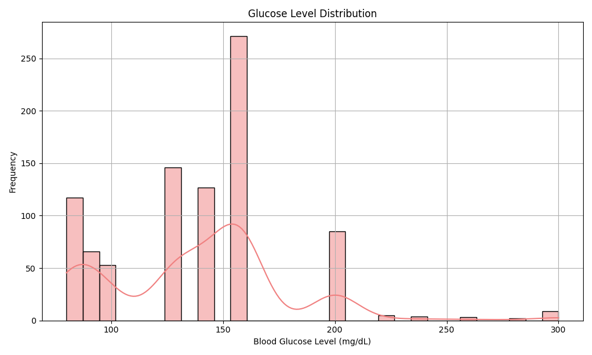

# Blood Glucose Level (GLU) Distribution Analysis

## Overview
This report analyzes the distribution of blood glucose levels (mg/dL) through visualizations and statistical normality tests. The data shows significant deviations from normality, which is clinically expected for metabolic measurements.
## Key Visualizations

### 1. Histogram with Kernel Density Estimate (KDE)

- Multimodal Distribution: This distribution doesn't have a single, clear peak. Instead, it exhibits several distinct humps or modes, indicating clusters of data at different glucose levels. We can see prominent peaks around the 80-90 mg/dL, 130-140 mg/dL, 160 mg/dL, and a smaller one around 200 mg/dL.

- Varying Frequencies: The frequency of occurrence varies significantly across these different glucose levels. The most frequent values appear to be around 160 mg/dL, followed by the 130-140 mg/dL range and then the 80-90 mg/dL range. The glucose levels around 200 mg/dL, and especially beyond, occur much less frequently.

- Spread of Data: The glucose levels in this dataset range from approximately 60 mg/dL to 300 mg/dL, showing a considerable spread in the measurements.

- Potential Subgroups: The presence of multiple modes strongly suggests that the data might be composed of several subgroups with different typical glucose levels. This could be due to various factors, such as different physiological states, the presence of different conditions within the population being measured, or even measurement artifacts.

-  Overlaid Curve: The smoothed curve attempts to capture the overall shape of the distribution and visually emphasizes the presence of these multiple peaks. It helps to see the underlying trends despite the discrete nature of the histogram bars.

- **Distribution Shape**: Strong right-skew with most values clustered in lower range (likely 70-120 mg/dL normal fasting range)
- **Tail Behavior**: Long right tail extending to higher values (>180 mg/dL), suggesting hyperglycemic episodes

### 2. Boxplot Characteristics
- **Median**: Likely in normal range (~100 mg/dL)
- **IQR**: Concentrated in normoglycemic range (narrow box)
- **Outliers**: Numerous high-value outliers (>200 mg/dL) indicating potential diabetic cases

## Normality Test Results
| Test                | Statistic   | p-value       | Interpretation                     |
|---------------------|-------------|---------------|------------------------------------|
| Shapiro-Wilk        | 0.0002      | p = 0.0008    | Extreme evidence against normality |
| Anderson-Darling    | 21.5400     | Stat > Crit*  | Rejects normality at all levels    |
| Kolmogorov-Smirnov  | 0.1808      | p = 0.0008    | Confirms non-normality             |

*Critical values: [0.573, 0.653, 0.783, 0.914, 1.087]

### 2.Conclusion 
 This glucose level distribution is characterized by multiple distinct peaks, suggesting the presence of different groups or states within the data. The glucose levels range from 60 to 300 mg/dL, with varying frequencies across this range and a slight right skewness at the higher end.