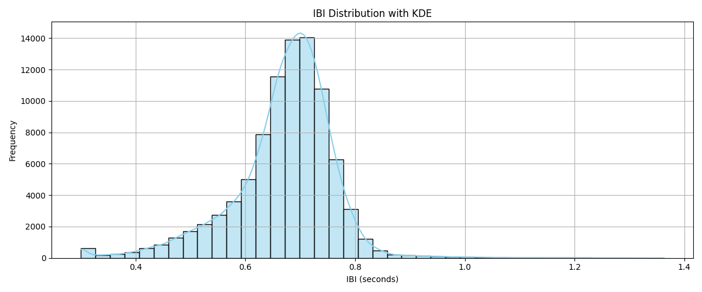
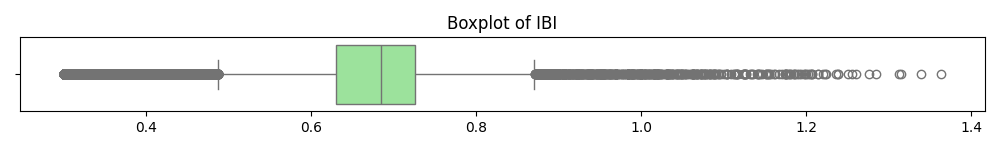
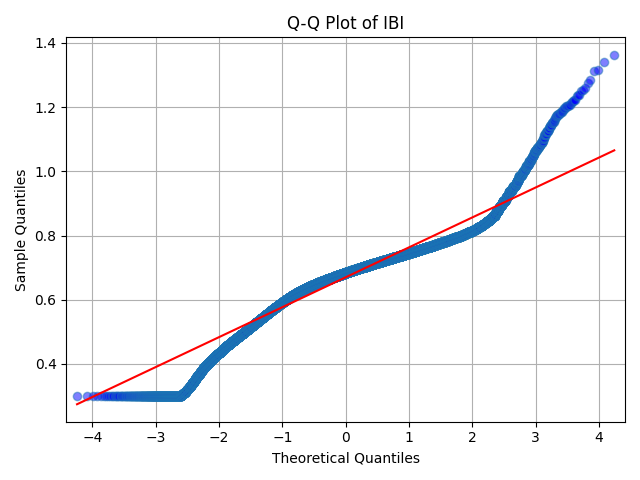

# Inter-Beat Interval (IBI) Distribution Analysis

This document provides an analysis of Inter-Beat Interval (IBI) data, including its distribution, central tendency, spread, skewness, and normality. The analysis is supported by a histogram with KDE, a boxplot, a Q-Q plot, and statistical normality test results.

## 1. IBI Distribution with KDE

The histogram illustrates the frequency distribution of IBI values (in seconds), overlaid with a Kernel Density Estimate (KDE) curve.

**Observations:**

* **Shape:** The distribution is **unimodal** and appears to be slightly **left-skewed**. It has a single, pronounced peak.
* **Central Tendency:** The peak of the distribution, representing the most frequent IBI values, is observed around **0.7 seconds**. This suggests that the typical time between heartbeats in this dataset is approximately 0.7 seconds.
* **Spread:** The IBI values range from approximately **0.3 seconds to about 1.4 seconds**. The majority of the data points are concentrated between 0.6 seconds and 0.8 seconds.
* **Skewness:** There is a slight but noticeable **left skew**, indicated by the tail extending more towards the lower IBI values. This suggests a presence of more frequent shorter IBIs compared to a symmetrical distribution.

## 2. Boxplot of IBI

The boxplot provides a summary of the IBI distribution, displaying quartiles, median, and identified outliers.

**Observations:**

* **Median:** The median line within the box appears to be close to 0.7 seconds, aligning with the peak observed in the histogram.
* **Interquartile Range (IQR):** The box, representing the middle 50% of the data, is relatively narrow, indicating that the central portion of IBI values is tightly clustered.
* **Outliers:** The boxplot clearly shows numerous individual points plotted beyond both the left and right whiskers. This indicates the presence of a significant number of **outliers** on both the lower and higher ends of the IBI spectrum.

## 3. Q-Q Plot of IBI

The Quantile-Quantile (Q-Q) plot compares the distribution of IBI values to a theoretical normal distribution.

**Observations:**

* **Deviation from Normality:** The data points significantly deviate from the red straight line, particularly at both the lower and upper tails. The 'S' shape of the plotted points indicates that the distribution is **not normally distributed**. The deviations suggest heavier tails than a normal distribution and a potential skew.

## 4. Normality Test Results for IBI

Statistical tests provide quantitative evidence regarding the normality of the IBI data.

**Results:**

* **Anderson-Darling Test:**
    * Statistic: 1585.214
    * Critical Values (at various significance levels):
        * 15.0% significance level: 0.576
        * 10.0% significance level: 0.656
        * 5.0% significance level: 0.787
        * 2.5% significance level: 0.918
        * 1.0% significance level: 1.092
    * *Interpretation:* The test statistic (1585.214) is substantially larger than all provided critical values. This leads to a strong **rejection of the null hypothesis** that the IBI data comes from a normal distribution.

* **Kolmogorov-Smirnov Test:**
    * Statistic: 0.09338
    * p-value: 0.00000
    * *Interpretation:* With a p-value of 0.00000 (which is significantly less than common significance levels like 0.05), we **reject the null hypothesis** that the IBI data is normally distributed.

## 5. Outlier Detection

* **Outliers Detected:** 1535 outliers (where $|z| > 3$) out of 89500 total values.
    * *Interpretation:* This indicates that approximately 1.71% of the IBI values are considered extreme, deviating significantly from the mean. This substantial number of outliers confirms the observations from the boxplot and Q-Q plot regarding non-normality and the presence of extreme values.

## Overall Conclusion

The analysis of the Inter-Beat Interval (IBI) data reveals the following key characteristics:

The IBI distribution is **unimodal** with a peak around **0.7 seconds**, indicating this as the most common time between heartbeats. The distribution exhibits a **slight left skew**, suggesting a higher frequency of shorter IBIs. The data is **not normally distributed**, as evidenced by the significant deviations in the Q-Q plot and the strong rejection of the null hypothesis by the Anderson-Darling and Kolmogorov-Smirnov tests (p-values of 0.00000).

Furthermore, a notable number of **outliers (1535 out of 89500 values, or 1.71%)** are present, indicating a considerable proportion of unusually short or long IBIs within the dataset. These outliers, along with the observed skewness, underscore that standard statistical methods assuming normality would be inappropriate for this dataset. Further analysis or modeling should account for the non-normal nature and the presence of outliers in the IBI data.

---

# Statistical Analysis of IBI Sum Data

This document summarizes the exploratory statistical analysis performed on the Inter-Beat Interval (IBI) sum data extracted firstly from 15 participants. Each participant's data consists of the sum of the first 100 consecutive IBI values, representing the total elapsed time (in seconds) for 100 heartbeats. After, we relied on OpenAI gpt-4o model to generate semantic and synthetic IBI seq in the same context.

## Dataset Overview

* **Data type:** Sum of IBI intervals over first 100 beats (in seconds)
* **Purpose:** To characterize heart rhythm variability as a baseline for synthetic data generation and stress detection modeling.

## Summary Statistics

| Metric    | Value   | Interpretation                                     |
| :-------- | :------ | :----------------------------------------------- |
| Mean      | 76.41   | Average total IBI time for 100 beats (seconds)   |
| Std Dev   | 8.04    | Moderate variability across participants         |
| Min       | 65.63   | Shortest total IBI sum (fastest heart rhythm)    |
| 25%       | 69.77   | First quartile of IBI sums                       |
| Median    | 77.21   | Middle value of total IBI sums                   |
| 75%       | 80.55   | Third quartile of IBI sums                       |
| Max       | 92.94   | Longest total IBI sum (slowest heart rhythm)     |

## Physiological Interpretation

* The mean sum of 76.41 seconds for 100 beats corresponds to an average heart rate of approximately 78.5 beats per minute (bpm) (calculated as $(100 \text{ beats} / 76.41 \text{ seconds}) \times 60 \text{ seconds/minute}$).
* Participant heart rates range from roughly 65 bpm (for the max sum of 92.94 seconds, $(100/92.94)*60 \approx 64.5$ bpm) to 91 bpm (for the min sum of 65.63 seconds, $(100/65.63)*60 \approx 91.4$ bpm), a typical resting or mild stress range in healthy adults.
* The observed variability (standard deviation ~8 seconds) indicates some diversity in heart rhythms, which may reflect individual physiological differences or measurement artifacts.