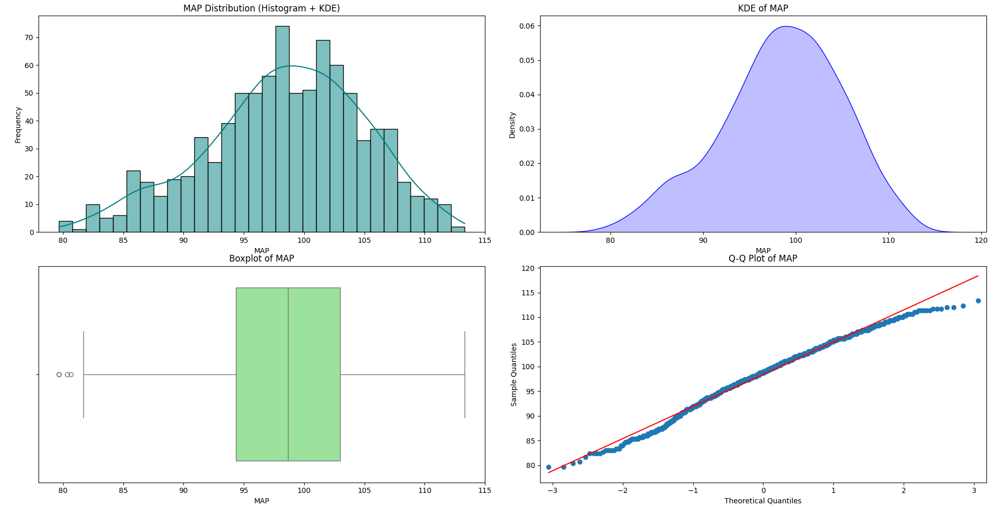
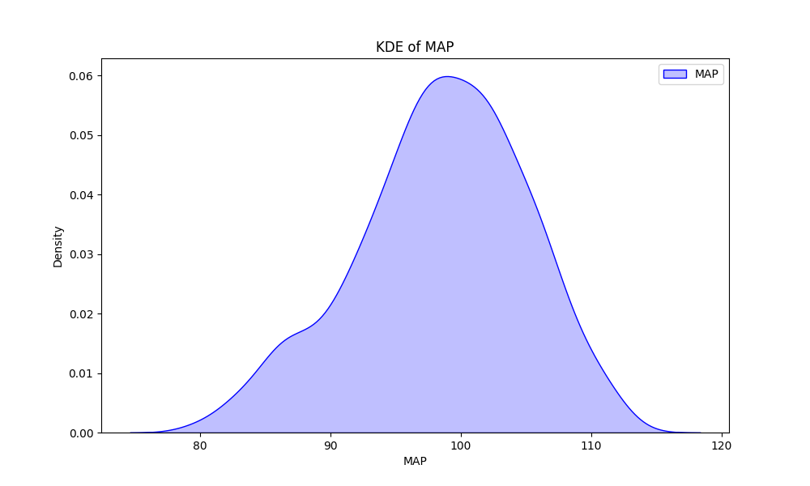

# Mean Arterial Pressure (MAP) Distribution Analysis

This document presents an analysis of Mean Arterial Pressure (MAP) data, including its distribution, central tendency, spread, and normality. The analysis is supported by a histogram with KDE, a boxplot, a Q-Q plot, and statistical normality test results.

## 1. MAP Distribution (Histogram + KDE)

The histogram displays the frequency distribution of Mean Arterial Pressure (MAP) values along with a Kernel Density Estimate (KDE) curve.

**Observations:**

* **Shape:** The distribution is **unimodal** and appears to be relatively **symmetrical**, with a slight tendency towards a bell-shaped curve. It has a single, clear peak.
* **Central Tendency:** The peak of the distribution, indicating the most frequent MAP range, appears to be around **98-100 mmHg**. This suggests that the typical MAP in this dataset falls within this range.
* **Spread:** The MAP values are distributed from approximately **80 mmHg to around 115 mmHg**. The bulk of the data points is concentrated between about 90 mmHg and 105 mmHg.
* **Skewness:** While generally symmetrical, there might be a very slight left skew, though it's not as pronounced as in some other biological distributions.
* **Outliers:** The histogram does not visually suggest prominent outliers.

## 2. KDE of MAP

The Kernel Density Estimate (KDE) plot provides a smoothed representation of the MAP distribution, highlighting its shape.

**Observations:**

* This plot reiterates the unimodal and generally symmetrical shape of the MAP distribution, with its peak around 98-100 mmHg. It provides a clearer visual of the density across the range of MAP values.

## 3. Boxplot of MAP

The boxplot summarizes the MAP distribution, showing quartiles, median, and potential outliers.

**Observations:**

* **Median:** The median line within the box appears to be close to 98-100 mmHg, consistent with the central tendency observed in the histogram.
* **Interquartile Range (IQR):** The box, representing the middle 50% of the data, is relatively narrow, indicating a tight clustering of the central MAP values.
* **Whiskers:** The whiskers extend to cover most of the data.
* **Outliers:** There are a few individual points plotted outside the whiskers on both the lower and higher ends. These might be considered mild outliers, but their number appears minimal.

## 4. Q-Q Plot of MAP

The Quantile-Quantile (Q-Q) plot compares the distribution of MAP values to a theoretical normal distribution.

**Observations:**

* **Deviation from Normality:** The data points generally follow the red straight line, especially in the central portion. However, there are slight deviations at both the lower and upper tails, indicating that the distribution is **not perfectly normally distributed**. The tails of the observed distribution appear slightly heavier or deviate from the normal distribution's tails.

## 5. Normality Test Results for MAP:

Statistical tests provide quantitative evidence regarding the normality of the MAP data.

* **Anderson-Darling Test:**
    * Statistic: 2.6116
    * Critical Values: [0.573, 0.653, 0.783, 0.914, 1.087]
    * Significance Levels: [15.0%, 10.0%, 5.0%, 2.5%, 1.0%]
    * *Interpretation:* The Anderson-Darling test statistic (2.6116) is significantly larger than all provided critical values across all significance levels. This leads to a strong **rejection of the null hypothesis** that the MAP data is normally distributed.

* **Kolmogorov-Smirnov Test:**
    * Statistic: 0.0414
    * p-value: 0.0928
    * *Interpretation:* With a p-value of 0.0928, which is greater than the commonly used significance level of 0.05, we **fail to reject the null hypothesis** that the data comes from a normal distribution. However, it's very close to 0.05, suggesting that while it doesn't definitively reject normality, it's borderline.

**Note on Normality Test Discrepancy:** It's important to note the apparent discrepancy between the Anderson-Darling test (rejects normality) and the Kolmogorov-Smirnov test (fails to reject normality at $\alpha=0.05$). The Anderson-Darling test gives more weight to the tails of the distribution, which is where the Q-Q plot showed the most deviation. The Kolmogorov-Smirnov test is less sensitive to deviations in the tails. Given the visual evidence from the Q-Q plot and the strong rejection by the Anderson-Darling test, it's more appropriate to conclude that the MAP distribution is **not strictly normal**, especially regarding its tail behavior.

## Overall Conclusion

The analysis of the Mean Arterial Pressure (MAP) data reveals the following key characteristics:

The MAP distribution is **unimodal** and largely **symmetrical**, with a prominent peak around **98-100 mmHg**. This range likely represents the typical MAP for the population sampled. The majority of MAP values fall between 90 mmHg and 105 mmHg, indicating a relatively concentrated distribution.

While the distribution visually resembles a normal distribution in its central tendency, the Q-Q plot shows slight deviations at the tails, suggesting that the data is not perfectly normal. The Anderson-Darling test strongly supports the conclusion of non-normality, particularly due to deviations in the tails. The Kolmogorov-Smirnov test, while failing to reject normality at a 0.05 significance level, presents a borderline p-value, which, when considered with other evidence, reinforces the idea that strict normality cannot be assumed.

In a clinical context, a normal MAP is generally considered to be between 70 and 100 mmHg, although some sources extend this range up to 110 mmHg. The observed mean and peak of 98-100 mmHg for this dataset fall within the higher end of the widely accepted normal range. This suggests that the population sampled may have MAP values on the higher side of normal.