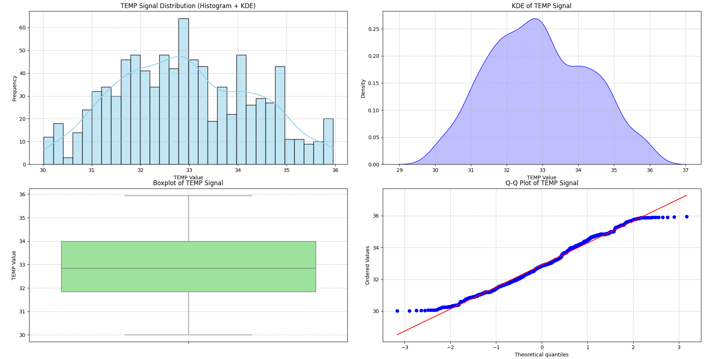

# TEMP Signal Distribution Analysis

This document provides a detailed analysis of the TEMP signal data, including its statistical properties, visual distributions, and normality assessment.

## 1. Summary Statistics for TEMP Signal

The following table presents key descriptive statistics for the TEMP signal.

| Metric    | Value       |
| :-------- | :---------- |
| count     | 888.00      |
| mean      | 32.8997     |
| std       | 1.3910      |
| min       | 30.0100     |
| 25%       | 31.8450     |
| 50%       | 32.8550     |
| 75%       | 33.9925     |
| max       | 35.9500     |

**Interpretation:**

* The dataset comprises **888** TEMP signal readings.
* The **mean** TEMP value is approximately **32.90**.
* The **standard deviation** of **1.39** indicates a moderate spread around the mean.
* TEMP values range from a **minimum of 30.01** to a **maximum of 35.95**.
* The **median** (50th percentile) is **32.855**, which is very close to the mean, suggesting a relatively symmetrical distribution.
* The interquartile range (IQR), from 31.845 (25th percentile) to 33.9925 (75th percentile), covers the central 50% of the data.

## 2. Visualizations of TEMP Signal Distribution

The following plots provide a visual representation of the TEMP signal's distribution characteristics.

### 2.1. TEMP Signal Distribution (Histogram + KDE)

This histogram shows the frequency of TEMP values, overlaid with a Kernel Density Estimate (KDE) to smooth the distribution.

**Observations:**

* **Shape:** The distribution appears to be **unimodal** with a single prominent peak. It is generally **symmetrical** and somewhat bell-shaped, though it exhibits some irregularities.
* **Central Tendency:** The peak of the distribution is centered around **32.5 - 33.0**, which aligns well with the calculated mean and median.
* **Spread:** Most of the data is concentrated between approximately 31 and 34.5, with tails extending towards 30 and 36.

### 2.2. KDE of TEMP Signal

This plot provides a smoothed density estimation of the TEMP signal, emphasizing its overall shape.

**Observations:**

* The KDE plot confirms the unimodal and roughly symmetrical nature of the distribution. It highlights the primary concentration of TEMP values around 32.5 - 33.0.

### 2.3. Boxplot of TEMP Signal

The boxplot summarizes the distribution by displaying quartiles, median, and potential outliers.

**Observations:**

* **Median:** The median line is close to the center of the box, confirming the near-symmetry observed in the histogram.
* **Interquartile Range (IQR):** The box is relatively compact, indicating that the central 50% of the data is closely clustered.
* **Whiskers:** The whiskers extend to cover the majority of the data.
* **Outliers:** There are no individual data points plotted beyond the whiskers, which is consistent with the outlier detection results (see Section 4).

### 2.4. Q-Q Plot of TEMP Signal

The Quantile-Quantile (Q-Q) plot compares the distribution of TEMP values to a theoretical normal distribution.

**Observations:**

* The data points generally follow the red straight line in the central portion. However, there are **slight deviations at both tails**, particularly at the lower end (below 31) and upper end (above 35). This suggests that while the distribution is somewhat normal-like, it deviates from a perfect normal distribution, especially in its extreme values.

## 3. Normality Test Results for TEMP Signal

Statistical tests provide quantitative evidence regarding the normality of the TEMP data.

* **Shapiro-Wilk Test:**
    * Statistic: 0.9845
    * p-value: 0.0000
    * *Interpretation:* With a p-value of 0.0000 (less than 0.05), we **reject the null hypothesis**. This indicates that the TEMP signal data is **NOT normally distributed**.

* **Kolmogorov-Smirnov Test (against normal with estimated parameters):**
    * Statistic: 0.0452
    * p-value: 0.0518
    * *Interpretation:* With a p-value of 0.0518 (slightly greater than 0.05), we **fail to reject the null hypothesis**. This suggests that, based on this test at the 0.05 significance level, the data *appears* normal.

**Note on Normality Test Discrepancy:**
There is a slight discrepancy between the Shapiro-Wilk and Kolmogorov-Smirnov tests. The Shapiro-Wilk test is generally more sensitive to deviations from normality, especially for smaller sample sizes (though 888 is not very small). The Kolmogorov-Smirnov test, while failing to reject normality at $\alpha=0.05$, has a p-value that is very close to the threshold. Considering the visual evidence from the Q-Q plot (deviations at tails) and the strong rejection by the Shapiro-Wilk test, it is prudent to conclude that the TEMP signal data **does not strictly adhere to a normal distribution**.

## 4. Outlier Detection (|z| > 3)

Outliers were identified using the Z-score method, where values with a Z-score absolute value greater than 3 are considered outliers.

* **Detected 0 outliers (|z| > 3) out of 888 values.**
* *Interpretation:* No significant outliers were detected in the TEMP signal data using the Z-score method. This suggests that there are no extreme values that are more than 3 standard deviations away from the mean.

## Overall Conclusion

The analysis of the TEMP signal data reveals a **unimodal and roughly symmetrical distribution** with a mean around **32.90**. While visually somewhat bell-shaped, statistical tests, particularly the Shapiro-Wilk test, indicate that the data **does not strictly follow a normal distribution**, primarily due to slight deviations in its tails as observed in the Q-Q plot. Importantly, no significant outliers were detected using the Z-score method.
