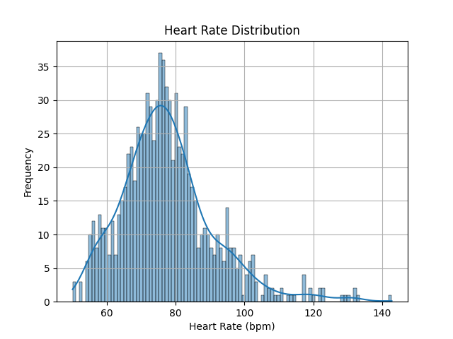
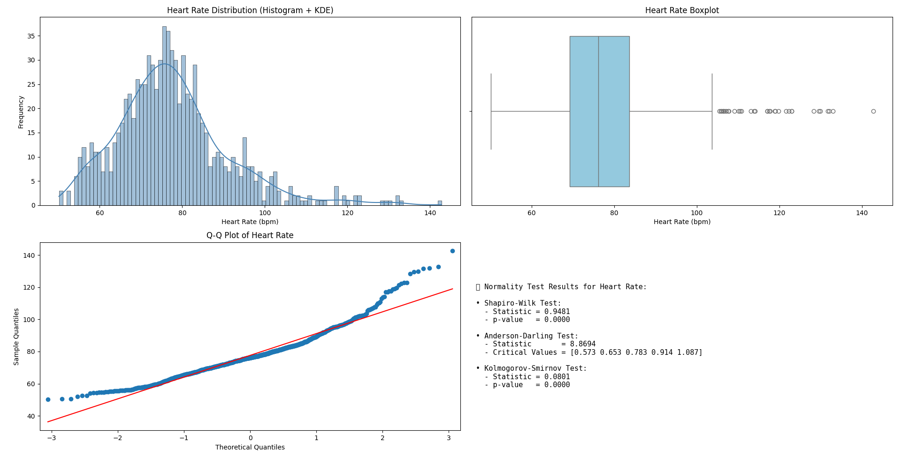

#Heart Rate Distribuition Analysis
This document presents an analysis of heart rate data, visualized through a histogram with KDE, a boxplot, a Q-Q plot, and normality test results.

### 1. Heart Rate Distribution (Histogram + KDE)

 - The histogram displays the distribution of heart rates (in beats per minute, bpm) 

 - Shape: This distribution is unimodal and noticeably right-skewed. It has a single, clear peak, and the tail extends towards the higher heart rate values.

 - Central Tendency: The peak of the distribution, indicating the most frequent heart rate range, appears to be around 76-80 bpm. This suggests that the typical heart rate in this dataset falls within this range.

 - Spread: The heart rates are distributed from approximately 50 bpm to around 145 bpm. The bulk of the data points is concentrated between about 60 bpm and 95 bpm.

 - Skewness: The right skew is quite evident here, indicating a considerable number of individuals with heart rates higher than the average. The tail extending beyond 100 bpm is more pronounced than in the previous distributions.

 - Outliers: There are several data points in the higher heart rate range (above 110 bpm) that stand out from the main cluster. These could be considered outliers depending on the context of the data.

This distribution  shows a similar central tendency but a more pronounced positive skew, suggesting a larger proportion of individuals with elevated heart rates in this specific dataset. The spread also appears slightly wider.

**Observations:**

* **Shape:** The distribution is **unimodal** and exhibits a noticeable **right-skew**. It has a single, clear peak, and the tail extends towards higher heart rate values.
* **Central Tendency:** The peak of the distribution, indicating the most frequent heart rate range, appears to be approximately **76-80 bpm**. This suggests that the typical heart rate in this dataset falls within this range.
* **Spread:** The heart rates range from approximately **50 bpm to around 145 bpm**. The bulk of the data points is concentrated between about 60 bpm and 95 bpm.
* **Skewness:** The right skew is quite evident, indicating a considerable number of individuals with heart rates higher than the average. The tail extending beyond 100 bpm is more pronounced compared to a symmetrical distribution.
* **Outliers:** There are several data points in the higher heart rate range (above 110 bpm) that stand out from the main cluster. These could be considered potential outliers.

### 2. Heart Rate Boxplot

The boxplot provides a summary of the heart rate distribution, highlighting quartiles, median, and potential outliers.

**Observations:**

* **Median:** The line within the box, representing the median heart rate, appears to be around 76-78 bpm, consistent with the histogram's central tendency.
* **Interquartile Range (IQR):** The box itself represents the middle 50% of the data. Its relatively compact size indicates that a significant portion of heart rates falls within a narrower range.
* **Whiskers:** The whiskers extend to cover most of the data points, showing the overall spread.
* **Outliers:** Several individual points are plotted beyond the upper whisker, confirming the presence of outliers in the higher heart rate range, as suggested by the histogram.

### 3. Q-Q Plot of Heart Rate

The Quantile-Quantile (Q-Q) plot compares the distribution of heart rates to a theoretical normal distribution.

**Observations:**

* **Deviation from Normality:** The data points significantly deviate from the red straight line, especially in the upper tail. This confirms that the heart rate distribution is **not normally distributed**, specifically showing a positive skew where higher theoretical quantiles correspond to increasingly higher observed quantiles.

### 4. Normality Test Results for Heart Rate

Statistical tests for normality provide quantitative measures of how well the data fits a normal distribution.

**Results:**

* **Shapiro-Wilk Test:**
    * Statistic = 0.9481
    * p-value = 0.0000
    * *Interpretation:* With a p-value of 0.0000 (which is less than common significance levels like 0.05), we **reject the null hypothesis** that the data is normally distributed.

* **Anderson-Darling Test:**
    * Statistic = 8.6694
    * Critical Values = [0.573, 0.653, 0.783, 0.914, 1.087]
    * *Interpretation:* The test statistic (8.6694) is much larger than all critical values, leading to the **rejection of the null hypothesis** of normality.

* **Kolmogorov-Smirnov Test:**
    * Statistic = 0.0801
    * p-value = 0.0000
    * *Interpretation:* Similar to the Shapiro-Wilk test, the p-value of 0.0000 leads to the **rejection of the null hypothesis** that the data follows a normal distribution.

**Conclusion from Normality Tests:** All three normality tests consistently indicate that the heart rate data **does not follow a normal distribution**. This aligns with the visual observations from the histogram, KDE, and Q-Q plot, which clearly show a right-skewed distribution.

## Conclusion

Based on the comprehensive analysis of the heart rate data:

This dataset represents a population where the typical resting heart rate is likely around **76-80 beats per minute**. However, the distribution is not symmetrical; it exhibits a noticeable **positive skew**. This skew indicates that while most individuals have heart rates in the typical to slightly elevated range, there is a substantial portion of the population with heart rates significantly higher than the average.

The spread of heart rates is relatively wide, ranging from around **50 bpm to 145 bpm**, suggesting variability within the population. The presence of several data points in the higher end of the spectrum (above 110 bpm) suggests the possibility of outliers or a subgroup within the population with naturally higher heart rates or measurements taken under different conditions (e.g., during or after activity, or individuals with specific health conditions).

In summary, while the central tendency points to a common heart rate range, the right skew highlights a considerable presence of higher heart rates within this population, making the average heart rate likely to be pulled slightly above the most frequent range. The data is definitively **not normally distributed**, which is an important consideration for any further statistical modeling or inference.

